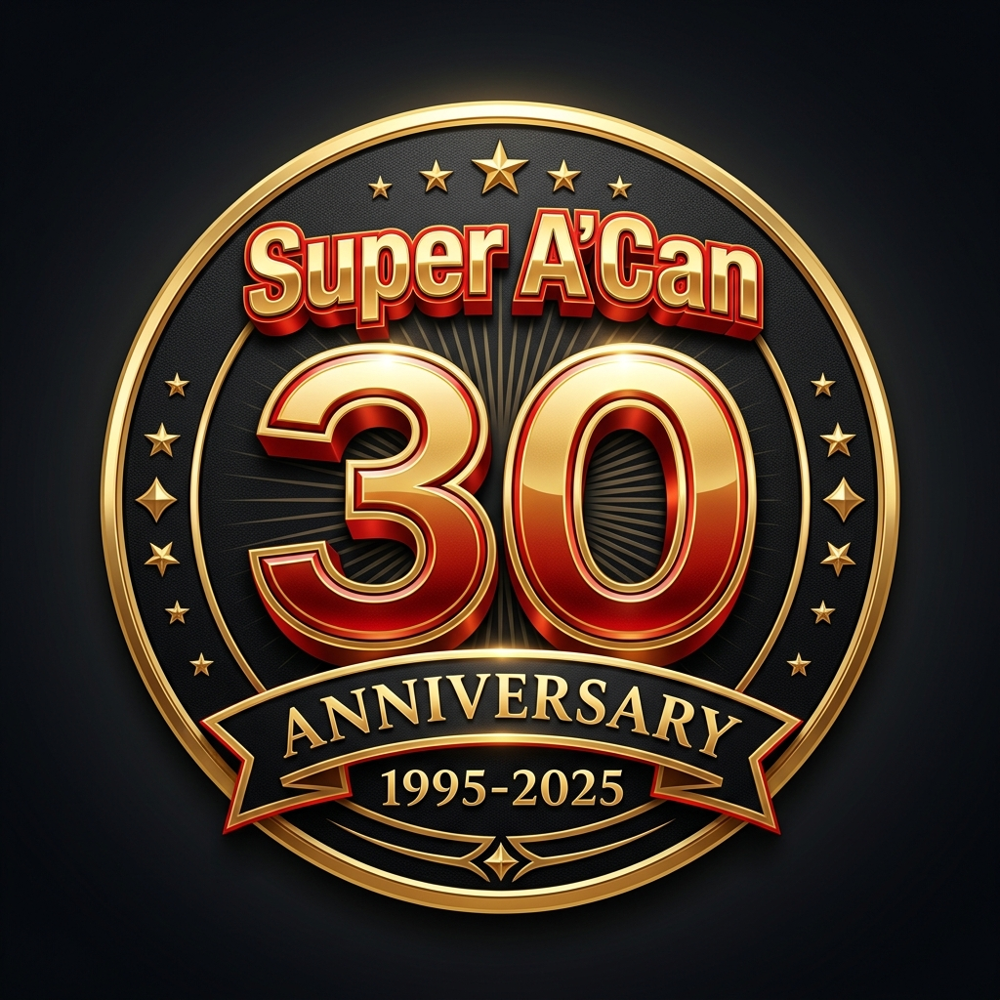

# Super A'Can Web Emulator 🎮

**English** | [繁體中文](./README.md)

<div align="right">

[](https://github.com/anomixer/superacan-web)
[](https://webassembly.org/)
[](LICENSE)
[](#-complete-game-list)

</div>

### 🌐 Live Demo: [https://anomixer.github.io/superacan-web/](https://anomixer.github.io/superacan-web/)

> 🎊 Celebrating the 30th Anniversary of the **Funtech Super A'Can** — Taiwan's only homegrown 16-bit game console!

<p align="center">
  
</p>

A browser-based Super A'Can emulator powered by **WebAssembly (WASM)**. This project deeply customizes the MAME core for the Web environment, delivering **100% native speed** gameplay — including all 12 official titles — directly in your browser with no installation required.

---

## ✨ Key Features

### ⚡ 100% Native Full-Speed Emulation
The performance-killing `perfect_quantum` has been removed from the MAME core and replaced with a custom `6000Hz` sync rate, achieving a rock-solid **60FPS** in the browser without sacrificing compatibility.

### 🎵 Dual-Core Audio Engine

This is one of the project's most significant technical breakthroughs. The UM6619 sound chip in the Super A'Can had a long-standing DMA handshake bug in MAME that caused certain games to produce "zombie loop noise" or fail to boot entirely. Two WASM builds are provided to handle both scenarios:

| WASM Core | Target Games | Audio Handling |
| :--- | :--- | :--- |
| `mamesupracan.wasm` | 8 standard games | 100% original high-fidelity audio |
| `mamesupracan-sndfix.wasm` | 4 problematic games ★ | Ghost-Buster ADSR buffer decay + DMA handshake fix |

> ★ **SndFix games**: Speedy Dragon (音速飛龍), Formosa Wars (福爾摩沙大對決), Super Chinese Baseball League (超級中華職棒聯盟), Hi-Journey (嘻遊記)

### 🖥️ Modern Frontend UI
- **Bilingual**: Traditional Chinese / English instant toggle
- **Responsive layout**: Collapsible sidebar with drag-to-resize
- **Two display modes**: "Fit Screen" and "Native 2x"
- **Dual video rendering modes**: Support toggling between "Hardware Acceleration (WebGL)" and "Software Rendering", with automatic preference saving
- **Three-state audio core toggle**: Support toggling between "Auto", "Original", and "Fixed" modes, allowing players to choose their audio preference, with automatic preference saving
- **Reliable mute control**: Dedicated GainNode, bypassing Emscripten's forced audio resume
- **📱 Mobile Virtual D-Pad**: On-screen controls for touch devices with **diagonal input support** (e.g., top-right combo); hidden in a bottom drawer on desktop, always visible on mobile with automatic viewport scaling

### 📚 Complete Digital Archive
A built-in digital museum covers all **12 official titles** with release year, developer info, and high-resolution cover art.

---

## 🕹️ Complete Game List

| # | Game Title | Audio Core |
| :---: | :--- | :---: |
| 1 | 音速飛龍 (Speedy Dragon) | SndFix |
| 2 | 福爾摩沙大對決 (Formosa Wars) | SndFix |
| 3 | 超級中華職棒聯盟 (Super Chinese Baseball League) | SndFix |
| 4 | 嘻遊記 (Hi-Journey) | SndFix |
| 5 | 爆爆動物園 (Boom Zoo) | Standard |
| 6 | 賭霸 (Gambling Lord) | Standard |
| 7 | 魔棒撞球 (Magical Pool) | Standard |
| 8 | 非洲探險大富翁 (Monopoly: Adventure in Africa) | Standard |
| 9 | 叛星 (Rebel Star) | Standard |
| 10 | 武將爭霸 (Sango Fighter) | Standard |
| 11 | 超級光明戰士 (Super Light Saga - Dragon Force) | Standard |
| 12 | 邪惡之子 (The Son of Evil) | Standard |

---

## ⚖️ Copyright and ROM Files (DMCA)

To comply with copyright and DMCA regulations, this repository **does not host or include** any Super A'Can BIOS or game ROM files. Our approach is as follows:

1.  **No Copyrighted Files in Repo**: All ROM files are strictly excluded from Git tracking and will never be pushed to GitHub.
2.  **Dynamic Local Download**: We provide a `node prepare.js` script. When players deploy the project locally, the script automatically downloads the required files from public archives (e.g., Archive.org).
3.  **Anti-Expiration Scraper**: To handle expiring download links on certain sites, the script includes a built-in scraper that simulates browser requests, ensuring players can always complete their local setup.

*Please note: This project only provides the emulator implementation. Users assume all legal responsibilities for downloading ROM files in accordance with local laws.*

---

## 🚀 Getting Started

Due to browser CORS restrictions, WASM files cannot be opened directly from the local filesystem. A local server is required.

**Requirement:** [Node.js](https://nodejs.org/)

```bash
# 1. Clone the repo
git clone https://github.com/anomixer/superacan-web.git
cd superacan-web

# 2. Prepare BIOS and Game files
# This script will automatically download and extract BIOS and games.
# (If you already have standard MAME .zip files, just place them in roms/supracan/ to skip download)
node prepare.js

# 3. Start the local server
node server.js

# 4. Open your browser
# Navigate to http://localhost:8080
```

---

## 📂 Project Structure

```text
superacan-web/
├── index.html          # Main page (contains UI and language dictionary)
├── index.css           # Stylesheet (Minimalist dark theme, RWD)
├── loader.js           # MAME loader (handles WASM preloading and compatibility)
├── games.js            # Database of 12 games (sensitized)
├── prepare.js          # Automated BIOS/ROM download and foolproof script
├── server.js           # Simple local Node.js server
├── hash/               # MAME software list definition
│   └── supracan.xml
├── supracan-fix/       # MAME core patches and docs (Archive)
│   ├── src/            # C++ modified source code
│   └── *.md            # Patch technical documentation
├── wasm/               # MAME WebAssembly core builds
│   ├── mamesupracan.wasm.gz         # Standard core
│   └── mamesupracan-sndfix.wasm.gz  # Audio fixed core
└── thumbs/             # Cover thumbnails for 12 games
```

---

## 🎮 Controls

Full keyboard support is built in. Press **`TAB`** in-game to open the MAME native menu and remap any button.

| A'Can Button | Default Key (1P) | Default Key (2P) |
| :--- | :---: | :---: |
| **D-Pad** | Arrow Keys | `R` `F` `D` `G` |
| **A** | `Ctrl` | `A` |
| **B** | `Space` | `Q` |
| **X** | `Alt` | `S` |
| **Y** | `L-Shift` | `W` |
| **L** | `Z` | `E` |
| **R** | `X` | — |
| **Select** | `5` | `6` |
| **Start** | `1` | `2` |

---

## 🛠️ Technical Architecture & Modifications

The following targeted modifications were made to the MAME `supracan` driver:

### 1. Video Rendering Optimization (`supracan.cpp`)
Introduced off-screen sprite clipping, restructured the rendering loop, and implemented conditional VRAM dirty-flagging to significantly reduce memory overhead in the WebAssembly environment.

### 2. Audio DMA Handshake Patch (`umc6619_sound.cpp`)
Fixed the status-clear mechanism for register `0x16`, allowing the 6502 co-processor to correctly receive DMA interrupts. This resolves both the boot failure and the "zombie noise loop" in affected titles — the core issue that blocked full 12-game support for over a decade.

### 3. WASM Frontend Integration (`loader.js`)
Switched to Software List mode instead of direct ROM mounting, resolving compatibility issues with multi-directory and multi-partition ROM structures so all 12 game images are correctly recognized.

---

## 📖 Why Did Full Super A'Can Support Take So Long?

The Super A'Can was a 16-bit home console released by Funtech (敦煌科技) in Taiwan in 1995 — the only consumer game console ever designed and manufactured in Taiwan. Due to commercial failure, only 12 games were ever released, and hardware documentation is virtually non-existent.

MAME added a `supracan` driver as far back as 2010 (v0.136), but "boots" and "fully playable" are very different standards:

- **2010**: CPU, display, and basic I/O emulated. Most games reach the title screen, barely.
- **2021**: MAME 0.233 WIP added rudimentary sound support, but envelope curves, voice samples, and DMA timing remained incomplete.
- **2024–2025**: The MAME 0.28x series progressively refined UM6619 audio chip behavior, bringing several titles to a playable state.

Based on the latest MAME core, this project further fixes the DMA handshake and audio decay issues, achieving **full playability for all 12 games** for the first time. On its 30th anniversary, we perfectly present the legend once again!

---

## 📜 Disclaimer

The emulator core in this project is derived from the open-source project [MAME](https://github.com/mamedev/mame), with specialized modifications for historical preservation and academic research of the Super A'Can. All game ROM copyrights belong to their respective owners. No ROM files are provided or distributed by this project.
